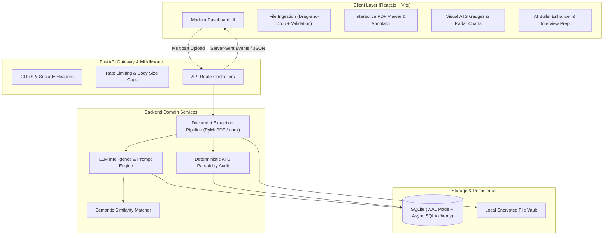
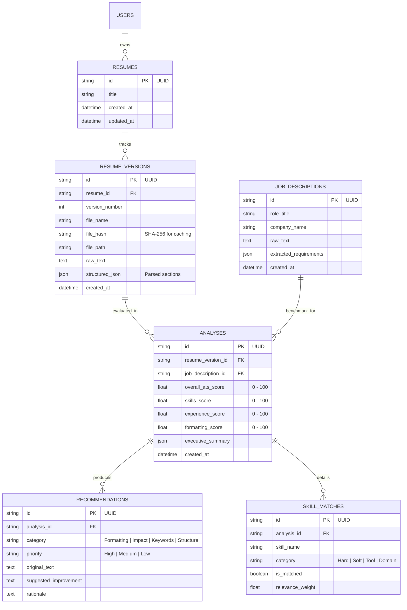
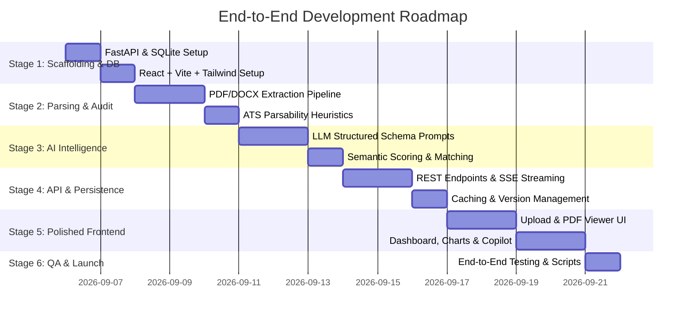

# AI-Powered Resume Analyzer & Career Copilot
## Senior Engineering Specification & End-to-End Implementation Roadmap

---

## 1. Executive Overview & Product Philosophy

The **AI-Powered Resume Analyzer** is an enterprise-grade, end-to-end career intelligence and recruitment analytics platform. Engineered with a **User-Centric (UX-First)** and **Domain-Driven Design (DDD)** philosophy, the application bridges the gap between candidates' resumes and modern Applicant Tracking Systems (ATS) / hiring managers.

### Core Value Propositions
1. **Zero-Friction Candidate Experience**: Instant drag-and-drop parsing, interactive live PDF preview, real-time analysis streaming, and intuitive visualizations.
2. **Deterministic & Semantic Intelligence**: Combines rule-based ATS parsability checks (margins, tables, fonts, headings) with deep LLM semantic matching (embeddings, skills taxonomy, experience depth).
3. **Actionable Career Copilot**: Instead of generic scores, the platform provides interactive tools to rewrite bullet points (using the Google **XYZ** / **STAR** formulas), generate targeted cover letters, and simulate tailored interview questions.
4. **Historical Versioning & Iterative Improvement**: Candidates can modify their resumes and track their ATS score progression over time against multiple job descriptions.

---

## 2. Technology Stack & Architectural Decisions

| Layer | Technology | Architectural Rationale |
| :--- | :--- | :--- |
| **Frontend Framework** | **React.js (Vite + TypeScript)** | Blazing fast build times, strict compile-time type safety, component modularity. |
| **Styling & UI Primitives** | **Tailwind CSS + Lucide Icons + Framer Motion** | Consistent design tokens, accessible components, polished micro-animations for high-end UX. |
| **State & Data Fetching** | **TanStack Query (React Query) + Zustand** | Server state caching, optimistic UI updates, zero boilerplate global UI state. |
| **PDF Rendering** | **react-pdf / PDF.js** | Native in-browser resume inspection with interactive text highlighting and annotation overlays. |
| **Backend Framework** | **Python 3.11+ / FastAPI (Async)** | Non-blocking asynchronous I/O, automatic OpenAPI/Swagger docs, high throughput. |
| **Data Validation** | **Pydantic v2** | Ultra-fast Rust-based serialization and strict request/response schema validation. |
| **Database & ORM** | **SQLite + SQLAlchemy 2.0 (Async) + Alembic** | Zero-latency embedded DB configured with **WAL (Write-Ahead Logging)** mode for concurrent reads/writes and migration tracking. |
| **Document Processing** | **PyMuPDF (`fitz`) + pdfplumber + python-docx** | Robust multi-layer extraction handling complex layouts, tables, and diverse document formats. |
| **AI / NLP Orchestration** | **Google Gemini API / OpenAI API (Structured JSON)** | Low-latency LLM inference, native function calling/JSON schema constraints, and embedding models. |

---

## 3. End-to-End System Architecture

---

## 4. Database Design (SQLite with WAL Mode)

---

## 5. Detailed UX/UI Architecture & Interaction Design

To ensure an exceptional user experience, the frontend is built around user feedback loops, zero cognitive overload, and progressive disclosure.

### UX Principles
1. **Sub-second Feedback & Skeletons**: Instant file validation (<50ms for size/extension), instant PDF preview, and animated skeleton loaders while AI analysis is running.
2. **Visual Hierarchy & At-a-Glance Insights**:
   - **Score Hero**: A prominent radial score gauge color-coded with semantic meaning (80-100: Green/Optimal, 60-79: Amber/Moderate, <60: Red/Needs Attention).
   - **Actionable Breakdown Tabs**: Overview, ATS Compliance, Skills Matrix, Bullet Point Enhancer, and Interview Simulator.
3. **Interactive Side-by-Side Comparison**:
   - Left Pane: Interactive PDF preview with highlighted keywords.
   - Right Pane: Job Description requirements checklist with matched vs. missing skills badges.
4. **Copy-to-Clipboard & One-Click Fixes**:
   - When AI suggests an enhanced bullet point using the STAR method, users can click "Copy Improved Version" or "Diff View" to inspect changes.
5. **Dark/Light Mode**: Full theme support with persistent local storage.

---

## 6. End-to-End Implementation Stages

### Stage 1: Engineering Foundation & Architecture Scaffolding
- **Backend Setup**:
  - Modular FastAPI folder structure (`app/api/`, `app/core/`, `app/db/`, `app/models/`, `app/schemas/`, `app/services/`).
  - Configure SQLite with `PRAGMA journal_mode=WAL;`, foreign key enforcement, and connection pooling.
  - Setup Pydantic v2 settings with environment variable validation (`.env.example`).
- **Frontend Setup**:
  - React 18+ with Vite and TypeScript.
  - Setup Tailwind CSS, `@radix-ui` accessible primitives, `lucide-react`, and `framer-motion`.
  - Configure Axios / Fetch clients with interceptors and toast notifications (`sonner`).

### Stage 2: Document Extraction & Deterministic ATS Audit
- **Multi-Engine Resume Ingestion**:
  - Primary: `PyMuPDF` (`fitz`) for lightning-fast text, font size, and layout coordinate extraction.
  - Secondary: `pdfplumber` for table detection and complex multi-column fallback.
  - Word documents: `python-docx` for `.docx` structure and bullet list parsing.
- **Deterministic ATS Parsability Checker**:
  - Audit for ATS traps: complex tables, graphics, header/footer text loss, font anomalies, non-standard section headers, multi-column reading order glitches.
  - Compute a deterministic **Formatting & Parsability Score** (0-100) independent of LLM.

### Stage 3: AI Intelligence Engine & Semantic Scoring
- **LLM Structured Extraction**:
  - Send sanitized resume text to Google Gemini / OpenAI with strict Pydantic JSON schemas.
  - Extract: Personal info, professional summary, work history (company, role, dates, quantified achievements), skills hierarchy (categorized into languages, frameworks, cloud, tools, domain).
- **Job Description Semantic Matching**:
  - Parse JD into must-have skills, nice-to-have skills, experience thresholds, and domain concepts.
  - Implement hybrid scoring:
    - `Exact Keyword Match`: Exact token matches for core industry tooling.
    - `Semantic Embeddings Match`: Cosine similarity for equivalent competencies (e.g., "GCP" matches "Google Cloud Platform", "FastAPI" aligns with "Python REST APIs").
- **Composite ATS Score Formula**:
  $$\text{Score} = (0.35 \times \text{Skills}) + (0.30 \times \text{Experience}) + (0.20 \times \text{Semantic Relevance}) + (0.15 \times \text{Formatting})$$

### Stage 4: Backend REST APIs & Production Persistence
- **API Surface**:
  - `POST /api/v1/resumes/upload`: Uploads, validates, hashes file (SHA-256 for caching), and extracts text.
  - `POST /api/v1/jobs/analyze`: Compares uploaded resume against job description (pasted text or job URL).
  - `GET /api/v1/analyses/{id}`: Returns complete analysis with granular breakdown.
  - `POST /api/v1/copilot/rewrite-bullet`: Takes a weak resume bullet, applies Google XYZ formula (*Accomplished [X] as measured by [Y], by doing [Z]*), and returns high-impact variants.
  - `POST /api/v1/copilot/interview-prep`: Generates 5 tailored technical & behavioral interview questions targeting candidate gaps.
  - `GET /api/v1/resumes/history`: Lists previous versions with score diff tracking.
- **Resilience & Performance**:
  - File hash deduplication: If identical file and JD are submitted, return cached analysis instantly.
  - Async non-blocking endpoints with standard error handling and HTTP status codes.

### Stage 5: High-End React.js Frontend Dashboard
- **Component Breakdown**:
  1. `ResumeDropzone`: Drag-and-drop zone with animated upload progress, file size checks, and instant preview modal.
  2. `JobDescriptionInput`: Smart input with sample presets (e.g. "Senior Full-Stack Engineer", "Data Scientist") for quick 1-click testing.
  3. `ScoreHeroSection`: SVG animated circular progress meter, color gradients, and grade badge (A+, B, etc.).
  4. `SkillsMatrix`: Interactive chip grid with toggle filters (All, Matched, Missing, Extra). Tooltips explaining why a missing skill matters.
  5. `ExperienceTimeline`: Parsed work experience rendered as an interactive timeline with flagged weak bullet points.
  6. `CopilotDrawer`: Interactive slide-out drawer where users can test rewrites, copy improved text, and explore interview questions.
  7. `ExportReportModal`: Download printable PDF or JSON analysis report.

### Stage 6: Quality Assurance, Security & Turnkey Scripts
- **Testing Suite**:
  - Backend: `pytest` covering parser edge cases, scoring calculations, and API routes.
  - Frontend: Component testing and smoke tests.
- **Security & Privacy**:
  - Input sanitization against prompt injection embedded in resume text.
  - Local file cleanup / retention policies.
- **Developer Experience & Deployment**:
  - One-click Windows runner (`start_dev.bat`): starts backend and frontend in parallel.
  - Docker Compose setup (`Dockerfile` for backend & frontend) for containerized deployment.
  - Comprehensive `README.md` with architectural diagrams and setup guides.

---

## 7. Verification & Success Criteria

1. **Extraction Accuracy**: Successfully parse 99% of standard single and two-column PDF/DOCX resumes.
2. **Speed & Latency**: Sub-second deterministic parsing; LLM analysis response within 3-5 seconds.
3. **User Experience**: Fluid 60fps animations, zero layout shifts, clean dark/light mode, and clear error toasts.
4. **Actionability**: Every identified gap is paired with a concrete recommendation or rewritten bullet.
5. **Reproducibility**: Clear automated setup requiring only `pip install` and `npm install` with zero manual database configuration.
